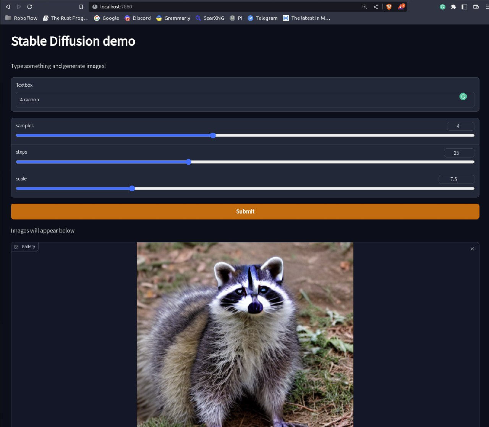

# My Spaces: self hosting 🤗 spaces


My Spaces allows you to quickly self-host almost any [hugging face space](https://huggingface.co/spaces) wherever you want!

Under the hood we are using docker and [nvidia pytorch containers](https://catalog.ngc.nvidia.com/orgs/nvidia/containers/pytorch)

Since hugging face doesn't distribute the docker image used in their spaces, a lot of spaces won't work due to broken links or stuff like that.

Not all space works, this is because I have no idea about which version of some package hugging face is using (e.g. `ffmepg`). If you are from hugging face, feel free to comment on this [issue](https://github.com/FrancescoSaverioZuppichini/my-spaces/issues/1)

This project aims to provide transparent and real open machine learning demo to the people. If something doesn't work please feel free to open an issue :)

Contributions are welcomed!

## Getting Started

You can also install the latest version on GitHub

```bash
pip install git+https://github.com/FrancescoSaverioZuppichini/my-spaces
```

TODO

## Run a space!

You need to get the hub token

### From a git repo url
```bash
export HUGGING_FACE_HUB_TOKEN=<YOUR_HUGGING_FACE_HUB_TOKEN>
my-spaces run https://huggingface.co/spaces/Francesco/stable-diffusion
```
Output
```
INFO:root:🚀 Running ...
INFO:root:🐋 Log from container: 
Downloading: 100%|██████████| 543/543 [00:00<00:00, 294kB/s]B/s]
Downloading: 100%|██████████| 342/342 [00:00<00:00, 277kB/s] ?it/s]
Downloading: 100%|██████████| 4.63k/4.63k [00:00<00:00, 3.51MB/s] 1.20s/it]
```
After a while, open up `http://localhost:7860/` if it was a gradio app, or `http://localhost:8501/` if it was a stremlit app 



**The generated Dockerfile will be inside `~/.my-spaces/dockerfiles`**


For each space, we create an docker image, build and run a container

All images use the `my-space` name and the repo name as `tag`. For example, using following space (that doesn't work on hugging face space gods only know why) `https://huggingface.co/spaces/Francesco/stable-diffusion` we will create an image named `my-spaces:stable-diffusion`.

### From Docker hub

I've personally [built and distributed the following images](https://hub.docker.com/repository/docker/zuppif/my-spaces), you run them by

```
export HUGGING_FACE_HUB_TOKEN=<YOUR_HUGGING_FACE_HUB_TOKEN>
my-spaces run  zuppif/my-spaces:stable-diffusion
```

## Q&A
**Works on Windows?**
No idea, please try and report back :)